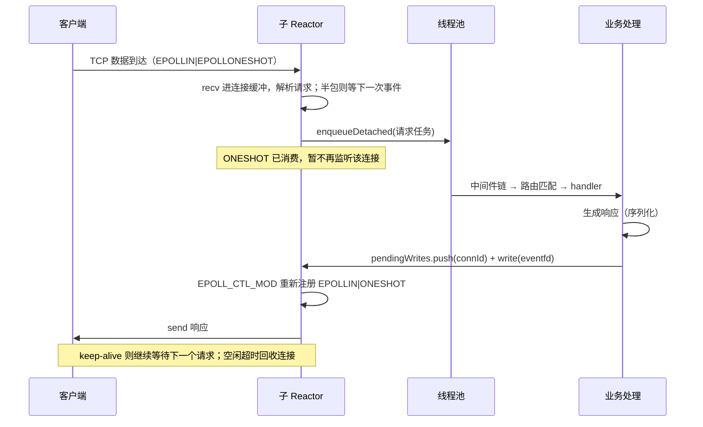

# HttpFramework

## 项目描述

HttpFramework 是一个 C++17 的 HTTP 服务框架，可选启用 WebSocket + TLS 1.3 扩展。
它覆盖从 socket 到业务处理的完整一层：多 Reactor 网络层、HTTP/1.1 解析与响应构造、
路由匹配、链式中间件、会话管理，以及基于线程池的异步处理模型。网络层由本项目实现，
不引入第三方网络库；接入方式是一个 CMake 目标，可以被 `find_package(HttpFramework)` 引入。

规模约 9500 行（`src/` + `include/`）；测试默认构建 12 个 ctest 目标，启用 WSS 后 15 个。

## 快速开始

### 依赖

```bash
# 必需
sudo apt install build-essential cmake libboost-all-dev

# 可选：数据库支持（未安装时相关功能与测试自动跳过）
sudo apt install libmysqlcppconn-dev

# 可选：WSS 扩展（TLS 1.3 + WebSocket），需要 OpenSSL 3.x
sudo apt install libssl-dev

# 可选：性能基准
sudo apt install wrk
```

### 构建

```bash
# 基础构建（仅 HTTP）
cmake -S . -B build -DCMAKE_BUILD_TYPE=Release
cmake --build build -j

# 启用 WSS 扩展
cmake -S . -B build-wss -DCMAKE_BUILD_TYPE=Release -DENABLE_WSS=ON
cmake --build build-wss -j
```

### 最小可运行示例

```cpp
#include "HttpFramework.h"

int main() {
    http::App app;

    app.get("/", [](const http::HttpRequest&, http::HttpResponse& res) {
        res.setJson(R"({"message":"hello"})");
    });

    app.get("/users/:id", [](const http::HttpRequest& req, http::HttpResponse& res) {
        res.setJson(R"({"id":")" + req.getParam("id") + R"("})");
    });

    return app.run(8080);
}
```

编译并运行，然后 `curl http://127.0.0.1:8080/users/42`。更多示例见
`examples/hello_world.cpp`、`examples/full_demo.cpp`（含中间件、会话、模板、数据库），
以及 `examples/wss_echo.cpp`（WebSocket 回声服务）。

### 集成到现有项目

```cmake
# 方式一：安装后按包引用
find_package(HttpFramework REQUIRED)
target_link_libraries(your_target PRIVATE http::framework)

# 方式二：作为子目录直接加入
add_subdirectory(third_party/HttpFramework)
target_link_libraries(your_target PRIVATE http::framework)
```

WSS 是可选的编译期开关：不启用时，WSS 相关代码不参与编译，也不会引入 OpenSSL 依赖。

## 功能特性

### HTTP 与路由

- **HTTP/1.1 解析与响应构造**：请求行/头部/正文字节级解析，含 400（畸形请求）、413（超限）等边界；
  HEAD 抑制响应体但保留 `Content-Length`；支持静态文件与模板渲染
- **三类路由匹配**：静态路径（哈希）、`:param` 动态段（分段匹配）、`*` 通配符（正则回退）；
  按 method 建索引，路径先按段切分再匹配，避免逐条正则
- **链式中间件**：洋葱模型 + 路径前缀过滤；鉴权、日志、限流等横切逻辑挂在这里
- **会话管理**：内存与文件两种存储，Cookie 生命周期（含滑动续期）、过期清理

### 并发模型

- **多 Reactor**：1 个主 Reactor 只做 accept，按 round-robin 把连接分给 N 个子 Reactor；
  每连接注册 `EPOLLIN | EPOLLET | EPOLLONESHOT`
- **独立线程池**：业务逻辑不在 Reactor 线程里跑，交给共享线程池；响应回写经 **eventfd** 唤醒
  子 Reactor 完成（工作线程不直接操作别人的 epoll）
- **HTTP 长连接**：支持 keep-alive 与空闲超时回收；管线化请求按序处理
- **固定块内存池（可选）**：请求/响应缓冲从预分配块里取，块大小与块数可配

### WebSocket（可选，`-DENABLE_WSS=ON`）

- **升级握手**：校验 `GET` / `Connection: Upgrade` / `Sec-WebSocket-Version` / 头长度上限
- **帧解析**：可重入状态机，处理半包、粘包、分片重组、掩码、控制帧、载荷上限与 UTF-8 校验
- **路由与中间件**：WebSocket 侧有独立的 `WsRouter` 与中间件链
- **独立事件循环**：WSS 有自己的 epoll 线程处理 TLS 握手与帧 I/O，与 HTTP 共享线程池

### 文件传输（示例插件）

分片传输协议 + bitmap 断点续传 + 双层 CRC32 校验，实现见示例中的传输中间件。

### 能力边界

- 只实现 **HTTP/1.1**（无 HTTP/2、HTTP/3）；不含反向代理、负载均衡、限流
- **单进程单实例**，无集群与主备；会话默认在内存，多实例间不共享
- 数据库层是**可选封装**（连接池 + 查询接口），不是 ORM
- WebSocket 是**编译期开关**，"开了 WSS"与"没开 WSS"是两个二进制，需分别验证
- 内存池对大响应不友好：请求侧超块回 413，响应侧超块回退 `std::string`
- 仅 Linux（epoll + eventfd）


## 架构

### 线程模型：多 Reactor + 线程池

```
                      ┌─────────────────────────────────────────┐
   客户端连接 ────────▶│ 主 Reactor 线程                          │
                      │   epoll_wait 只做 accept                 │
                      └────────────────┬────────────────────────┘
                                       │ round-robin 分发
                  ┌────────────────────┼────────────────────┐
                  ▼                    ▼                    ▼
         ┌────────────────┐   ┌────────────────┐   ┌────────────────┐
         │ 子 Reactor 0   │   │ 子 Reactor 1   │   │ 子 Reactor N   │
         │ EPOLLIN|ET     │   │ ...            │   │ ...            │
         │ |ONESHOT       │   │                │   │                │
         └───────┬────────┘   └───────┬────────┘   └───────┬────────┘
                 │  请求收齐后入队      │                    │
                 └───────────┬─────────┴────────────────────┘
                             ▼
                  ┌──────────────────────────┐
                  │ 共享线程池（默认 4 线程） │  业务处理：中间件链 → 路由 → handler
                  └───────────┬──────────────┘
                              │ 写响应：push 到目标连接的 pendingWrites
                              │ 然后 write(eventfd) 唤醒**属于该连接**的子 Reactor
                              ▼
                  子 Reactor 线程：从队列取出 → EPOLL_CTL_MOD 重新注册 → send
```

**为什么不让工作线程直接 send / 改 epoll**：子 Reactor 的 epoll 实例是被它自己的线程独占的，
工作线程去 `EPOLL_CTL_MOD` 相当于两个线程并发操作同一个 epoll；而且连接注册的是 `EPOLLONESHOT`，
从别的线程改状态会打乱"一次事件一次处理"的语义，可能造成重复投递或丢失事件。
所以回写动作经 `eventfd` 唤醒后**收敛回子 Reactor 线程**执行。

### 请求生命周期



### WSS 的事件循环（`-DENABLE_WSS=ON`）

```
HTTP 路径:  N 个子 Reactor（各自 epoll）────┐
                                           ├──▶ 共享线程池 ──▶ 业务（中间件/路由/handler）
WSS 路径:   1 个 WssReactor（独立 epoll 线程）┘
             ├─ TLS 1.3 握手、SSL_read / SSL_write
             ├─ 帧解析：可重入状态机（TLS 记录边界与帧边界不对齐）
             └─ 只有**解析出完整帧**才把消息交给线程池
```

两条路径共用同一个线程池，因此业务层代码（中间件、鉴权、日志）可以复用；
但 TLS 与帧 I/O 完全在 WssReactor 线程里完成，不占用子 Reactor。

### 连接生命周期

- **归属校验**：每个连接用 `ConnId = (generation << 32) | fd` 标识。fd 会被内核复用，
  只按 fd 记录会让"旧连接的回调"误伤刚建立的新连接（这正是早期一个真实缺陷的根因）
- **半关闭处理**：对端 FIN 后先把缓冲读尽再判 EOF；只发 FIN 不一定产生新边沿（ET 下尤其要注意），
  所以每个 epoll 节拍会主动检查各连接的空闲与 read 状态
- **优雅停机**：`stop()` 先排空在途业务任务，再释放成员，避免共享线程池上的任务访问已析构对象

## 核心组件

| 组件 | 职责与关键设计 |
|---|---|
| **HttpServer** | epoll ET + `EPOLLONESHOT` 主循环、accept 分发、连接表（代际校验）、空闲超时扫描、连接数上限 |
| **ConnectionHandler** | 单连接读写状态机：半包、管线化、EOF、`Content-Length`/chunked 边界 |
| **HttpRequest / HttpResponse** | 解析与构造：URL 解码、头名大小写归一化、`HEAD` 抑制响应体、序列化用 reserve + 直接拼接 |
| **Router** | 静态哈希 + `:param` 分段匹配 + `*` 正则回退；method 索引；运行期注册走"拷贝-换入"快照 |
| **Middleware** | 洋葱模型 + 路径前缀过滤；入口处一次性算好匹配列表，避免每请求整表重算 |
| **SessionManager** | 内存 / 文件两种存储、Cookie 生命周期（滑动续期）、过期清理、文件存储 ID 白名单 + 原子写 |
| **MemoryPool** | 固定块（默认 12 KB × 5000）、惰性初始化、分配计数可观测、可运行期开关（默认关闭） |
| **ThreadPool** | 任务队列 + 状态统计；`enqueueDetached` 提供无 `packaged_task`/`future` 的轻量路径 |
| **WssReactor** | TLS 1.3 握手、帧解析状态机、活跃连接集合、出站队列（`SSL_write` 移出锁） |
| **WsRouter** | WebSocket 侧路由，按升级路径缓存解析结果 |


## 关键设计与取舍

**回写为什么走 eventfd。** 子 Reactor 的 epoll 实例被它自己的线程独占，工作线程直接
`EPOLL_CTL_MOD` 等于两个线程并发操作同一个 epoll；再加上连接注册的是 `EPOLLONESHOT`，
跨线程改状态会打乱"一次事件一次处理"的语义。用 `eventfd` 把回写收敛回 Reactor 线程，
代价是每次响应多一次跨线程唤醒（实测这个开销远小于并发操作 epoll 的风险）。

**为什么做固定块内存池，以及为什么默认关闭。** 动机是"高频分配"——早期是短连接形态，
每请求新建/销毁缓冲。但长连接改造之后，500 并发 30 秒里池的 `allocate/deallocate`
只增加 1002 次（每千请求约 1 次），复用度已经由连接本身提供；在 glibc 的 per-thread
`tcache` 面前，这把带锁的池不再有优势。三轮交替复测的方向分别是 −3.5% / +6.1% / +1.1%，
**只能说"无可观测收益"**，所以默认关闭（另外它会预分配约 20 MB）。

**0-RTT 的取舍。** TLS 1.3 的 0-RTT 能省一个 RTT，但有重放风险。OpenSSL 内置的
anti-replay 要求服务端缓存票据，多实例部署下不可用，所以本项目显式关掉它，改在应用层
用请求头里的 `X-Nonce` + 带 TTL 的 seen 表判重。**这意味着安全责任从库移到了应用**：
nonce 校验必须是必选项，且默认配置不开 0-RTT。

**TLS 记录边界不等于 WebSocket 帧边界。** 一次 `SSL_read` 可能只返回半个帧、也可能一次
带回多个帧；而升级请求和头几批数据还可能挤在同一个 TLS 记录里。所以解析器必须是**可重入
状态机**：任何位置字节不够就退出并保留未消费数据，下次进来接着解；一次 feed 允许解出多个帧。

**响应序列化。** 早期实现逐个字段拼接、反复扩容；现在先 `reserve` 再直接拼接，
并把 `Date` 头按秒缓存，避免每个响应都做一次时间格式化。

**路径参数怎么塞回请求对象。** 路由匹配出的 `:param` 需要交给 handler。当前实现由
`RouterHandler` 用 `const_cast` 把参数写回 `HttpRequest`——它不在"未定义行为"的意义上有问题
（对象本身不是 const），但确实是个不漂亮的接口，记在待办里。

## 项目难点

### ① TLS 记录边界与 WebSocket 帧边界不对齐

**难在哪**：WebSocket 帧长在 TLS 记录的载荷里，而 TLS 记录长度与帧长度毫无关系。
一次 `SSL_read` 的返回值可能是：半个帧、一个帧、多个帧、甚至"升级请求 + 前几帧"。
天真写法（"读到数据就当一帧解"）在真机上会立刻错位。

**怎么做的**：可重入状态机。解析器维护"已收字节 / 当前帧状态"，任何位置字节不够就
**保留未消费数据并退出**，下次 `feed` 接着解；一次调用允许连续解出多个帧。
分片、控制帧、RSV 位、掩码位、载荷上限、UTF-8 合法性都在解析器里校验，非法帧直接断连
（关闭码区分：分片超限 1009、非法 UTF-8 1007、非最小编码 1002）。

**验证**：`tests/test_wss_hardening.cpp` 覆盖升级校验、`onClose` 时序、分片上限、
出站顺序、半开连接回收、Close 帧送达；`test_wss_router.cpp` 覆盖计划缓存生命周期。

### ② 跨线程回写：工作线程不能碰别人的 epoll

**难在哪**：连接注册的是 `EPOLLONESHOT`，事件被消费后必须由**同一个** Reactor 线程重新注册。
第一版让工作线程直接对子 Reactor 的 epoll 做 `EPOLL_CTL_MOD`，问题有两个：
① 两个线程并发操作同一个 epoll 实例；② oneshot 状态下 MOD 会重置状态，可能重复投递或丢事件。

**怎么做的**：每个子 Reactor 一个 `eventfd` + 一个 `pendingWrites` 队列。工作线程只做两件事：
把连接的 `ConnId` push 进队列、`write(eventfd)`。send 与重新注册全部收敛回子 Reactor 线程。
**顺带**：正因为回写带了 `ConnId`，这里必须做归属校验（见 ⑤），否则队列里躺着的旧连接
回调会打到已经复用同一 fd 的新连接上。

### ③ 0-RTT 重放防护：把责任从库移到应用

**难在哪**：0-RTT 的吸引力是省一个 RTT（对短连接场景可观），但允许重放。OpenSSL 的
anti-replay 依赖服务端缓存 session ticket——单机可用，**多实例部署直接失效**。

**取舍**：显式关闭 OpenSSL 的 anti-replay，改在应用层判重（`X-Nonce` + TTL seen 表），
并**默认不开 0-RTT**。这个取舍是明确的：安全责任从库移到了应用，所以 nonce 校验必须
是必选项而不是可选装饰。

**如实交代的边界**：目前只有"H9：设了环境变量也不影响非 0-RTT 连接升级"这一条用例，
**缺少 early data + `X-Nonce` 判重的端到端验证**（记在 TODO 的 I5）。

### ④ 内存池带来的两个问题

**问题一：12 KB 单块导致响应被静默截断。** `HttpContext::setResponseData` 在池模式下
调 `responseBuffer_->write(data)` 却**忽略返回值**，而单块只有 12 KB。现象很隐蔽：
响应头写着 `Content-Length: 20000`，客户端实收 12117–12289 字节，keep-alive 下后续请求还会错位。
修法是响应侧超限回退 `std::string`、请求侧比对实际写入字节数并回 413（带 `{"limit":...}`）。

**问题二：它其实没有收益。** 长连接改造之后池的调用频率降到每千请求约 1 次
（500 并发 30 秒累计 1,008,350 请求，`allocate/deallocate` 只增加 1,002 次），
三轮交替复测方向翻转。**结论是默认关闭**——理由是无收益 + 多占约 20 MB，而不是"性能更差"。

### ⑤ 连接生命周期与 fd 归属：陈旧回调误杀新连接

**难在哪**：fd 会被内核复用。只按 fd 记录连接状态时，"上一个连接的回调"可能作用在
**刚复用同一 fd 的新连接**上。现象是服务端日志里出现**两条相同 fd 的关闭记录**
（分别来自不同的子 Reactor），而新连接复用几次之后就被单方面断开——客户端看到的是"莫名 RST"。

**怎么做的**：连接标识改为 `ConnId = (generation << 32) | fd`，所有回写与关闭都带归属校验，
代际不匹配就丢弃。复测：记录恒为每 Reactor 各一条、连接复用 8–17 次全部正常。

**为什么值得讲**：这类缺陷在压测里表现为"偶发连接断开"，很容易被归因成"客户端或网络问题"
而放过去；把它定位到"fd 复用 + 缺少代际"需要先怀疑自己的状态模型。


## 实测性能

> 环境：2 vCPU / 1968 MB 的 VPS（**压测端与被测服务同机 loopback**），服务线程池 4，`wrk 4.2.0`（`-t4`）
> 测量脚本：`scripts/bench_http.sh` —— 启动服务后会**校验监听者身份**，结果落盘 `results/http_bench_<时间戳>.txt`
> 下表是 2026-09-20 用该脚本重跑的一批。与更早批次相比，每请求 CPU 与短连接吞吐有差异（机器状态不同），两批数据都保留在 `results/`

### 并发梯度（长连接）

| 并发 | 吞吐 (req/s) | p50 | p99 | socket 错误 |
|---|---|---|---|---|
| 100 | 34,042 | 2.74 ms | 6.43 ms | 0 |
| 500 | 34,530 | 13.91 ms | 26.53 ms | 0 |
| 1000 | 33,032 | 29.45 ms | 51.45 ms | 0 |
| 2000 | 31,629 | 61.53 ms | 99.44 ms | 0 |
| 5000 | **30,917** | 157.43 ms | 233.57 ms | 0 |

**读法**：多次测量落在 **30k–38k** 区间（±6%），这一批在 31k–35k。**5,000 并发下仍保持 3 万 req/s 且零 socket 错误**。
延迟随并发近似线性增长（符合 `延迟 ≈ 并发 ÷ 吞吐` 的排队关系），所以"低延迟"与"高并发"必须**同时标注档位**才有意义。

### 每请求 CPU

| 指标 | 数值 |
|---|---|
| 每请求 CPU（c=1000，`/proc/<pid>/stat` 差分 ÷ 请求数） | **37.1 µs**（3478 jiffies / 936,791 请求） |

更早批次用同一方法测到 32.3 µs —— 差异来自机器状态而非代码改动，两批都留在 `results/` 里。

### 路由与中间件的重复匹配（优化前后对照）

| 场景 | 优化前 | 优化后 |
|---|---|---|
| 50 层中间件（c=1000） | 1,810 req/s | **31,134 req/s（×17.2）** |
| 500 条路由、命中**末条** | 11,069 req/s | **40,115 req/s（×3.6）** |
| 500 条路由、命中靠前 | —— | ×1.11 |

根因是每个请求都把中间件链与路由表**整表重算**（`findMiddlewares` 走 O(M) 正则、路由逐条匹配）。
改动是入口处一次性算好中间件列表，路由改为 method 索引 + 静态哈希 + 分段匹配。
"命中靠前只有 ×1.11"说明收益来自"**找得对不对**"，而不是"找得快"。

### 内存池：无可观测收益

交替执行（默认 ↔ `--mempool`），各 30 秒：

| 轮次 | 无池 (req/s) | 开池 (req/s) |
|---|---|---|
| 1 | 35,914 | 34,885 |
| 2 | 31,444 | 32,466 |
| 3 | 31,442 | 33,915 |

**三轮方向不一致**（第 1 轮无池快、第 2/3 轮开池快），差异全在噪声内 ⇒ 只能表述为**无可观测收益**，不给百分比。
原因是池的调用频率太低：500 并发 30 秒累计 1,008,350 请求，`allocate/deallocate` 只增加 **1,002 次**
（每千请求约 1 次，可用 `curl /stats` 读 `mempool.alloc_calls` 复现）。**因此默认关闭**，
理由是无收益 + 多占约 20 MB。


### WebSocket over TLS 1.3（`-DENABLE_WSS=ON`）

用 `examples/wss_echo`（回声服务）与 `examples/wss_bench_client`（逐条发送并等回显、记录往返延迟）测得：

| 档位 | 吞吐 |
|---|---|
| 消息往返 256 B | 8,871 msg/s |
| 消息往返 1 KB | 8,919 msg/s |
| 消息往返 16 KB | 4,170 msg/s |
| TLS 握手 | 19.0 次/秒（50 成功 / 0 失败） |
| 并发连接 | 100/100 建立成功（判据：升级响应首行匹配 `^HTTP/1.[01] 101`） |

16 KB 档低于小包是预期的（超过 MSS 会被拆成十几段），但仍保持 4 千 msg/s 量级。
原始输出见 `results/wss-fixed-20260920/`。

### 短连接

三次测量的前两次是 10,590 / 10,895 req/s。短连接吞吐受客户端端口与 TIME_WAIT 资源影响、
波动可达 30%+，**只作区间参考（约 1.0–1.1 万 req/s）**，不参与任何结论。

## 测试与基准

### 单元与集成测试

```bash
# 默认配置（仅 HTTP）
cmake -S . -B build -DCMAKE_BUILD_TYPE=Release && cmake --build build -j
cd build && ctest --output-on-failure          # 12/12

# 启用 WSS 扩展
cmake -S . -B build-wss -DCMAKE_BUILD_TYPE=Release -DENABLE_WSS=ON
cmake --build build-wss -j && cd build-wss && ctest --output-on-failure   # 15/15
```

| 测试文件 | 覆盖内容 | 用例数 |
|---|---|---|
| `test_infra_threadpool` | 线程池：入队/批量/队列/关闭/状态 | 9 |
| `test_infra_mempool` | 内存池：分配/FIFO/耗尽/RAII/统计 | 11 |
| `test_infra_logger` | 日志：级别过滤/模块过滤/输出 | 6 |
| `test_http_route` | 路由：静态/动态/通配符/`:param` 形态等价性/404/方法 | 11 |
| `test_http_middleware` | 中间件链：洋葱模型/路径过滤/鉴权 | 6 |
| `test_http_session` | 会话：CRUD/过期/清理/Cookie | 13 |
| `test_http_response` | 响应构建：HTML/JSON/File/Binary/重定向 | 12 |
| `test_http_template` | 模板：加载/变量替换/fallback | 5 |
| `test_http_db` | 数据库连接池：初始化/获取/查询/计数/TCP 探测（无库时 1 通过 + 5 跳过） | 6 |
| `test_edge_input` | 异常输入：Header 过大/路径穿越/畸形请求 | 7 |
| `test_edge_stress` | 并发压力：1000 请求/统计/重启/fd 泄露 | 4 |
| `test_http_hardening` | 加固回归：信号/管线化/框架头/慢速滴灌/畸形请求 | 20 |
| `test_http_keepalive` | 长连接：复用/管线化/空闲回收 | 5 |
| `test_wss_hardening` | WSS 回归：升级校验/`onClose`/分片上限/出站顺序/半开连接/Close 帧（需 WSS） | 11 |
| `test_wss_router` | WsRouter 计划缓存生命周期与失效（需 WSS） | 3 |

**"跳过"是独立的第三种结果**：需要外部依赖（数据库、证书）的用例在依赖缺失时明确 SKIP 并打印原因，
**不计入通过**——例如无数据库时 `test_http_db` 是"1 通过 + 5 跳过"、退出码 0。
（ctest 这一层目前还区分不了跳过，记在 TODO 里。）

**测试设计**：全部使用真实文件系统 + 真实 loopback socket + 真实 OpenSSL，**不用 mock**。
好处是能覆盖真实的失败路径：`EADDRINUSE` 端口冲突、缺失文件回 404、模板缺失 fallback、
session 过期与清理、中间件鉴权短路 401、`shutdown` 后 `enqueue` 抛异常、内存池耗尽返回 `nullptr`。

### 性能基准

```bash
bash scripts/bench_http.sh          # 全量：并发梯度 + 每请求 CPU + 内存池交替 + 短连接（约 8 分钟）
bash scripts/bench_http.sh quick    # 快速回归：100/1000 两档 + 内存池单轮（约 2 分钟）
```

脚本启动服务后会校验监听者身份，不通过则把整批标记作废；结果统一写入 `results/`。

## 构建选项与配置

| 选项 | 默认 | 说明 |
|---|---|---|
| `CMAKE_BUILD_TYPE` | 未指定 | 建议 `Release`（不指定时不做优化，性能数据不可比） |
| `ENABLE_WSS` | `OFF` | 启用 WebSocket + TLS 1.3 扩展（需要 OpenSSL 3.x） |
| `BUILD_EXAMPLES` | `ON` | 编译 `examples/` 下的示例与 `bench_server` |
| `ENABLE_STRICT_WARNINGS` | `OFF` | 把部分警告提升为错误（`-Werror=return-type` / `-Werror=unused-result`） |
| `SANITIZE` | 空 | 传 `address` / `thread` 启用对应 sanitizer（需要手工跑，未进 CI） |

运行时配置集中在 `http::App` 与 `HttpServer`：监听端口与连接数上限、空闲超时、服务线程池大小、
内存池开关与块大小/块数、静态文件根目录、模板目录、会话存储方式与过期时间。

## API 参考

> 下面是公开接口速查；**完整签名与默认值以 `include/` 下的头文件为准**，示例见 `examples/`。

### App

```cpp
namespace http {
class App {
public:
    using Handler    = router::Router::Handler;
    using Middleware = router::Router::Middleware;

    // 路由注册（链式调用）
    App& get(const std::string& path, Handler h);
    App& post(const std::string& path, Handler h);
    App& put(const std::string& path, Handler h);
    App& del(const std::string& path, Handler h);
    App& patch(const std::string& path, Handler h);
    App& head(const std::string& path, Handler h);
    App& options(const std::string& path, Handler h);

    // 中间件
    App& use(Middleware m);                        // 全局
    App& use(const std::string& path, Middleware m); // 路径特定
    App& notFound(Handler h);

    // 快捷功能
    App& enableLogging();
    App& enableSession(int expirationSeconds = 1800, int cleanupIntervalSeconds = 300);
    App& enableMemoryPool(bool enable = true);
    App& enableDatabase(const std::string& host, const std::string& user,
                        const std::string& password, const std::string& database,
                        int port = 3306, int maxConnections = 5);

    // WSS 扩展（需 ENABLE_WSS=ON）
    App& enableWss(uint16_t port, const std::string& certFile, const std::string& keyFile);
    App& ws(const std::string& path, wss::WsHandler handler);
    App& useWs(wss::WsMiddleware mw);
    App& useWs(const std::string& path, wss::WsMiddleware mw);
    App& onWsOpen(const std::string& path, wss::WsOpenHandler h);
    App& onWsClose(const std::string& path, wss::WsCloseHandler h);

    // 生命周期
    void start(int port, int threads = 4);
    void stop();

    // 访问底层对象
    std::shared_ptr<router::Router>           router();
    std::shared_ptr<session::SessionManager>  sessionManager();
    std::shared_ptr<db::DbConnectionPool>     dbPool();
    const http::HttpServer::Statistics&       stats();
};
}
```

### HttpServer

```cpp
class HttpServer {
public:
    HttpServer(int port, size_t threadPoolSize = hardware_concurrency,
               size_t subReactorCount = 0);     // 0 = hardware_concurrency
    void start();
    void stop();
    void setRouter(std::shared_ptr<router::Router> router);
    void enableMemoryPool(bool enable = true);
    bool isRunning() const;
};
```

### Router

```cpp
class Router {
public:
    void get(const std::string& path, Handler handler);
    void post(const std::string& path, Handler handler);
    void put(const std::string& path, Handler handler);
    void del(const std::string& path, Handler handler);
    void patch(const std::string& path, Handler handler);
    void head(const std::string& path, Handler handler);
    void options(const std::string& path, Handler handler);
    void use(const std::string& path, Middleware middleware);
    void use(Middleware middleware);
    void setNotFoundHandler(Handler handler);
};
```

### HttpRequest

```cpp
class HttpRequest {
public:
    HttpMethod getMethod() const;
    std::string getMethodString() const;
    std::string getPath() const;
    std::string getHeader(const std::string& name) const;
    std::string getParam(const std::string& name) const;   // 路由参数 :id
    std::string getQuery(const std::string& name) const;   // 查询参数 ?key=val
    std::string getBody() const;
    bool isKeepAlive() const;
    size_t getContentLength() const;
    void setUserData(const std::string& key, const std::string& value);
    std::string getUserData(const std::string& key) const;
};
```

### HttpResponse

```cpp
class HttpResponse {
public:
    void setStatus(HttpStatus status);
    void setHeader(const std::string& name, const std::string& value);
    void setHtml(const std::string& html);
    void setJson(const std::string& json);
    void setText(const std::string& text);
    void setFile(const std::string& filePath);
    void setBody(const std::string& body);
    void setContentType(const std::string& contentType);
};
```
